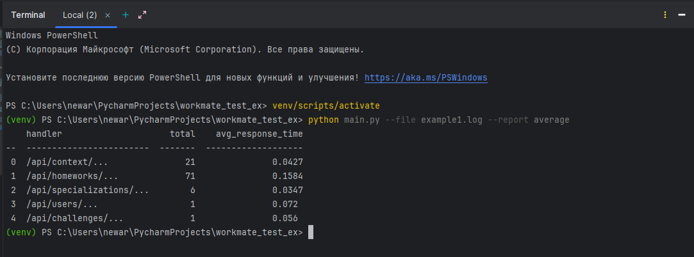

# Тестовое задание от Workmate

# Как запускать программу
### 1) Создайте виртуальное окружение командой
    
    python -m venv venv

### 2) Активируйте вирутальное окружение командой
    
    Для Windows:

    venv/scripts/activate

    Для UNIX/Linux:

    source venv/bin/activate

### 3) Установите зависимости командой

    pip install -r requirements.txt

### 4) Запустите программу
Запуск производится командой

    python main.py --file *имя файла* --report *название отчета*

# Тестирование

Все тесты находятся в папке tests. Для запуска всех тестов необходимо ввести команду:

    pytest

Для просмотра отчета о покрытии тестами введите команду:

     pytest --cov=src --cov-report=html

Затем перейдите в htmlcov/index.html

# Пример запуска программы

